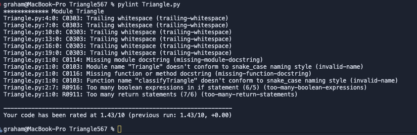
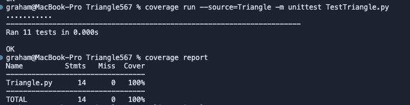
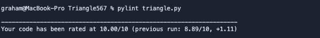

# HW 05 - Static Code Analysis

1. <https://github.com/grahamprimm/Triangle567>
2. Tool: pylint
   a. Output:

      ```bash
      graham@MacBook-Pro Triangle567 % pylint Triangle.py 
      ************* Module Triangle
      Triangle.py:4:0: C0303: Trailing whitespace (trailing-whitespace)
      Triangle.py:7:0: C0303: Trailing whitespace (trailing-whitespace)
      Triangle.py:10:0: C0303: Trailing whitespace (trailing-whitespace)
      Triangle.py:13:0: C0303: Trailing whitespace (trailing-whitespace)
      Triangle.py:16:0: C0303: Trailing whitespace (trailing-whitespace)
      Triangle.py:19:0: C0303: Trailing whitespace (trailing-whitespace)
      Triangle.py:1:0: C0114: Missing module docstring (missing-module-docstring)
      Triangle.py:1:0: C0103: Module name "Triangle" doesn't conform to snake_case naming style (invalid-name)
      Triangle.py:1:0: C0116: Missing function or method docstring (missing-function-docstring)
      Triangle.py:1:0: C0103: Function name "classifyTriangle" doesn't conform to snake_case naming style (invalid-name)
      Triangle.py:2:7: R0916: Too many boolean expressions in if statement (6/5) (too-many-boolean-expressions)
      Triangle.py:1:0: R0911: Too many return statements (7/6) (too-many-return-statements)

      -----------------------------------
      Your code has been rated at 1.43/10
      ```

3. Tool: Coverage.py
    a. Output:

      ```bash
      graham@MacBook-Pro Triangle567 % coverage run --source=Triangle -m unittest TestTriangle.py
      ...........
      ----------------------------------------------------------------------
      Ran 11 tests in 0.000s

      OK
      graham@MacBook-Pro Triangle567 % coverage report
      Name          Stmts   Miss  Cover
      ---------------------------------
      Triangle.py      14      0   100%
      ---------------------------------
      TOTAL            14      0   100%
      ```

4. No changes were required to achieve 100% coverage.
5. Results
   1. Pylint original
     
   2. Coverage Original
     
   3. Pylint final
     
   4. Not applicable
