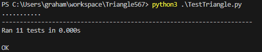

# SSW567 - HW 02a

### 1. Assignment Description

Sometimes you will be given a program that someone else has written, and you will be asked to fix, update and enhance that program.   In this assignment you will start with an existing implementation of the classify triangle program that will be given to you.   You will also be given a starter test program that tests the classify triangle program, but those tests are not complete.  

- These are the two files:  Triangle.py and TestTriangle.py
  - Triangle.py is a starter implementation of the triangle classification program.  
  - TestTriangle.py  contains a starter set of unittest test cases to test the classifyTriangle() function in the file Triangle.py file.   

In order to determine if the program is correctly implemented, you will need to update the set of test cases in the test program.  You will need to update the test program until you feel that your tests adequately test all of the conditions.   Then you should run the complete set of tests against the original triangle program to see how correct the triangle program is.    Capture and then report on those results in a formal test report described below.   For this first part you should not make any changes to the classify triangle program.  You should only change the test program.

Based on the results of your initial tests, you will then update the classify triangle program to fix all defects.  Continue to run the test cases as you fix defects until all of the defects have been fixed.   Run one final execution of the test program and capture and then report on those results in a formal test report described below.   

Note that you should NOT simply replace the logic with your logic from Assignment 1.  Test teams typically don't have the luxury of rewriting code from scratch and instead must fix what's delivered to the test team.   

Triangle.py contains an implementation of the classifyTriangle() function with a few bugs.  

TestTriangle.py contains the initial set of test cases

### 2. Author

Graham Primm

### 3. Summary

**Results Summary**: The initial implementation of the `classifyTriangle()` function was flawed, with 8 out of 11 test cases failing. After inspecting and fixing the defects, all test cases passed successfully. The final implementation correctly classified all triangles, and no further defects were found.

**Reflection**: This assignment highlighted the importance of comprehensive testing in identifying bugs. Writing unit tests helped to uncover flaws in the existing logic. What worked well was the systematic testing approach using `unittest` in Python, which allowed for thorough verification. Initially, the function mishandled valid triangles and incorrectly flagged them as invalid inputs, but after refining the logic, all defects were corrected. The challenge was identifying the subtle bugs within the logic for handling triangle validity and classification, which emphasized the need for careful debugging and testing.

### 4. Honor Pledge

I pledge that this submission is my own work and has not been copied from any other source.

### 5. Detailed Results

**Techniques Used**: The main technique used was unit testing with the `unittest` module in Python. The test cases were enhanced to cover edge cases such as invalid inputs, equilateral, isosceles, right, and scalene triangles. Each defect in the original implementation was identified using the test cases, after which the code was revised and retested.

**Assumptions**: I assumed the side lengths provided were integers and that the input values should not exceed 200 or be less than or equal to 0, as per the initial constraints.

**Data Inputs**: Various triangle side lengths were tested, including cases where the sides did not form a valid triangle, as well as special cases like right, equilateral, and isosceles triangles.

### 6. Explanation of Results

Initial Test Report

| Test ID | Input     | Expected Result | Actual Result | Pass or Fail |
| ------- | --------- | --------------- | ------------- | ------------ |
| T1      | 3, 4, 5   | Right           | InvalidInput  | Fail         |
| T2      | 5, 12, 13 | Right           | InvalidInput  | Fail         |
| T3      | 1, 1, 1   | Equilateral     | InvalidInput  | Fail         |
| T4      | 5, 5, 8   | Isosceles       | InvalidInput  | Fail         |
| T5      | 8, 8, 5   | Isosceles       | InvalidInput  | Fail         |
| T6      | 7, 5, 9   | Scalene         | InvalidInput  | Fail         |
| T7      | 1, 2, 3   | NotATriangle    | InvalidInput  | Fail         |
| T8      | 5, 9, 3   | NotATriangle    | InvalidInput  | Fail         |
| T9      | 201, 1, 1 | InvalidInput    | InvalidInput  | Pass         |
| T10     | -1, 5, 7  | InvalidInput    | InvalidInput  | Pass         |
| T11     | 5.5, 5, 5 | InvalidInput    | InvalidInput  | Pass         |

#### Final Test Report

After fixing the bugs in `classifyTriangle()`:

| Test ID | Input     | Expected Result | Actual Result | Pass or Fail |
| ------- | --------- | --------------- | ------------- | ------------ |
| T1      | 3, 4, 5   | Right           | Right         | Pass         |
| T2      | 5, 12, 13 | Right           | Right         | Pass         |
| T3      | 1, 1, 1   | Equilateral     | Equilateral   | Pass         |
| T4      | 5, 5, 8   | Isosceles       | Isosceles     | Pass         |
| T5      | 8, 8, 5   | Isosceles       | Isosceles     | Pass         |
| T6      | 7, 5, 9   | Scalene         | Scalene       | Pass         |
| T7      | 1, 2, 3   | NotATriangle    | NotATriangle  | Pass         |
| T8      | 5, 9, 3   | NotATriangle    | NotATriangle  | Pass         |
| T9      | 201, 1, 1 | InvalidInput    | InvalidInput  | Pass         |
| T10     | -1, 5, 7  | InvalidInput    | InvalidInput  | Pass         |
| T11     | 5.5, 5, 5 | InvalidInput    | InvalidInput  | Pass         |

### Matrix Summary of Test Results

|                          | Test Run 1 | Test Run 2 |
| ------------------------ | ---------- | ---------- |
| **Tests Planned**  | 11         | 11         |
| **Tests Executed** | 11         | 11         |
| **Tests Passed**   | 3          | 11         |
| **Defects Found**  | 8          | 0          |
| **Defects Fixed**  | 0          | 8          |

### Final Submission

Included in the submission are:

1. The source code for the improved `classifyTriangle()` function (`Triangle.py`).
2. The enhanced test set (`TestTriangle.py`).
3. A screen dump showing the test results from running the final test set.
